# Project Introduction
The goal was to create a simple API that could ingest Youtube trending video data, then using Kafka, Apache Spark, and MongoDB, build a document streaming pipeline to Streamlit for viewing the data and creating dashboards.

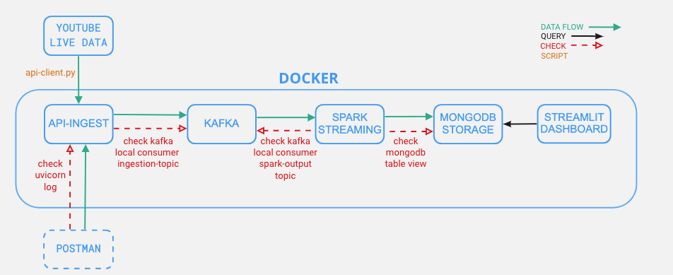

# Build the Pipelines
## Data Preparation
- Use a [small historical data file](./client/smalldata.csv) for testing, this <a href="https://www.kaggle.com/datasnaek/youtube-new?select=USvideos.csv" target="_blank">dataset</a> is from Kaggle
- Get an <a href="https://developers.google.com/youtube/v3/getting-started" target="_blank">api key</a> to request live data from YouTube using [get-data.py](./client/get-data.py), you can refer to this <a href="https://github.com/mitchelljy/Trending-YouTube-Scraper" target="_blank"> project</a>
- [Transform](./client/transformer.py) the output csv data file to a txt file and ingest line by line in json format

## API Preparation
- Setup FastAPI ([main.py](./API-Ingest/app/main.py))
    - Create a schema for the video records then set the data type in the base model
    - Create two methods, one is GET to display a message to make sure the API is running 
    - Another method is POST, convert the *trending_date* column to a standard date format and post the record as a json string to Kafka
    - Comment out the call to the *produce_kafka_string* function on line 64 when testing the API with Postman
    - Install libraries: `pip install kafka-python`, `pip install fastapi`, `pip install uvicorn[standard]`
    - Go to the app folder in your terminal and run `uvicorn main:app --reload`
    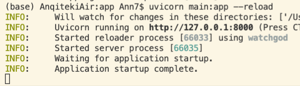
    - Go to *http://127.0.0.1:8000*, you should see the message *Hello World!*
- Test with Postman
    - Import the [test file](./API-Ingest/Postman/IngestAPI-Test.postman_collection.json) directly or you can build your own
    - Use one record to test the post request. Check that the request was received successfully in either Postman or terminal. Note the *trending_date* column is in the correct format
    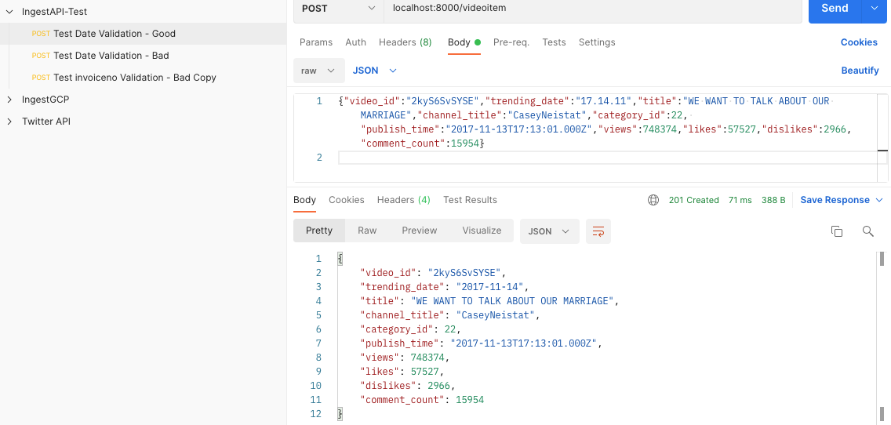
    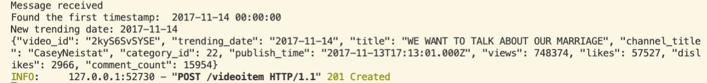
 
## Apache Kafka
### Setup Docker for Kafka
- Run `docker-compose -f docker-compose-kafka.yml up`

### Setup Kafka Topic
- Attach terminal to the running container (I used VSC, so just locate the container and right click, then you can *Attach Shell*)
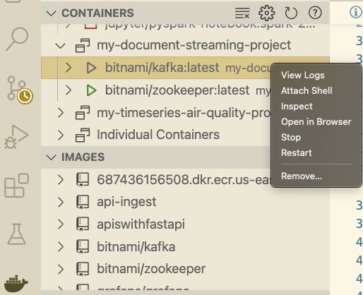
- Run `cd /opt/bitnami/kafka/bin`
- Check if there are existing topics: `./kafka-topics.sh --list --bootstrap-server localhost:9092`
- Create the *ingestion-topic*: `./kafka-topics.sh --create --topic ingestion-topic --bootstrap-server localhost:9092`
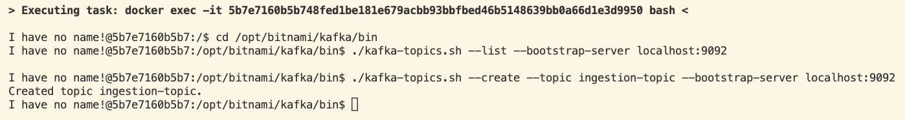

### Setup Local Consumer
- Create a local consumer to test if messages are received as expected: `./kafka-console-consumer.sh --topic ingestion-topic --bootstrap-server localhost:9092`
- While the local consumer is waiting for messages:
    - Go to *main.py* and uncomment the call to `produce_kafka_string` on line 64. Also make sure bootstrap_servers=*'localhost:9093'* (this is the external listener)
    - Test with Postman: send the same record and see if both Postman and local consumer receive it successfully
    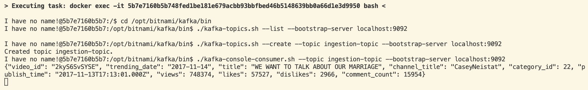
    - Stop the Docker container

### Move API to Docker and Connect with Kafka
- Go to *main.py* and change bootstrap_servers='kafka:9092', as we are moving from external to client
- Create an image for API app, use [dockerfile](./API-Ingest/dockerfile) and [requirements](./API-Ingest/requirements.txt), run `docker build -t api-ingest .`
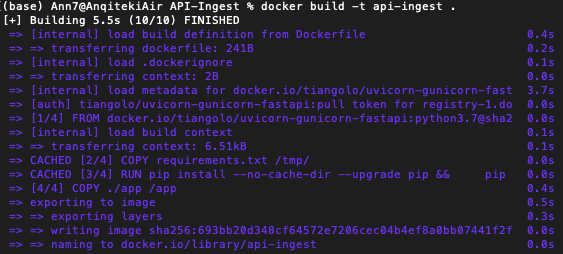
- Once it is finished, use `docker images` to see the image that was just created

### Deploy the API
- Start the *Kafka* container
- Check the network for the Kafka container (in my case it's *my-document-streaming-project_default*)
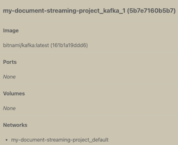
- Open a new terminal, run `docker run --rm --network my-document-streaming-project_default --name my-api-ingest -p 80:80 api-ingest`

### Test the API container with Kafka
- Once application startup is completed, create a local consumer again
- While the consumer is waiting, change the port number from *8000* to *80* in Postman and post a record like before
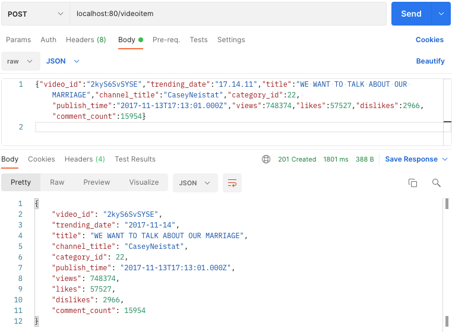
- Both Postman and local consumer receive the same message successfully
- Stop the Docker container

## Apache Spark
### Add Spark and Jupyter Notebook to Docker
- Run `docker-compose -f docker-compose-kafka-spark.yml up`
- Once the container is running, go to *view logs* to get the token
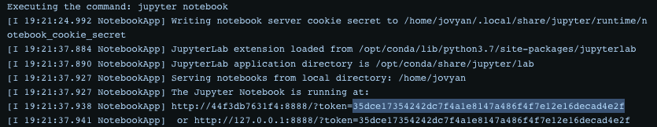 
- Go to *localhost:8888* to enter the token and open jupyter notebook (this was configured in the docker compose yaml file), you should see 2 notebooks there already

### Spark Streaming
- In [01-streaming-kafka-src-dst.ipynb](./ApacheSpark/01-streaming-kafka-src-dst.ipynb), the goal is to setup a Spark session to listen to messages from Kafka on one topic, and after receiving the message, send it back to Kafka using a second topic (*spark-output*) for testing
- Create a new topic *spark-output*: `./kafka-topics.sh --create --topic spark-output --bootstrap-server localhost:9092`
- Check to see if both topics are there: `./kafka-topics.sh --list --bootstrap-server localhost:9092`
- Create a local consumer: `./kafka-console-consumer.sh --topic spark-output --bootstrap-server localhost:9092`
- Execute the notebook then go to Postman and send the same record again
- The message should appear in local consumer and you should see the confirmation in the terminal
- You can also check out the Spark cluster interface at *localhost:4040*
- Stop the container

## MongoDB
### Add MongoDB to Docker
- Run `docker-compose -f docker-compose-kafka-spark-mongodb.yml up`
- Go to localhost:8081
- Create a DB called docstreaming and create a collection *videos* to store all the records from Spark streaming
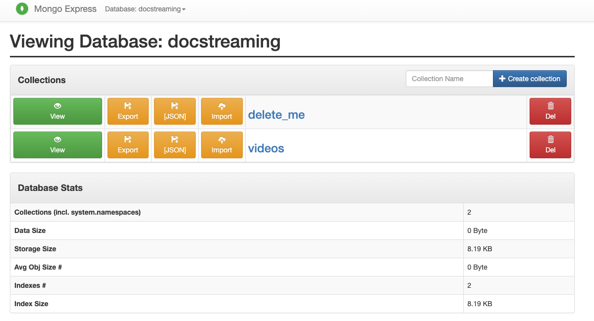

### Connect Spark to MongoDB
- Go to [02-streaming-kafka-src-dst-mongodb.ipynb](./ApacheSpark/02-streaming-kafka-src-dst-mongodb.ipynb)
- Note code block 6 adds a dataframe transformation to set the output table in MongoDB 
- Execute the notebook then go to Postman and post a record. Check to see that it appeared in the MongoDB collection properly
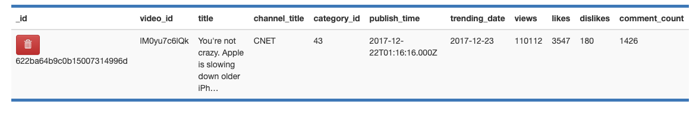

## API Client Writes Data
- Clean up MongoDB table if you sent test record earlier
- Use [api-client.py](./client/api-client.py) to send the most recent trending video records
- Multiple batches with all the records are stored in MongoDB
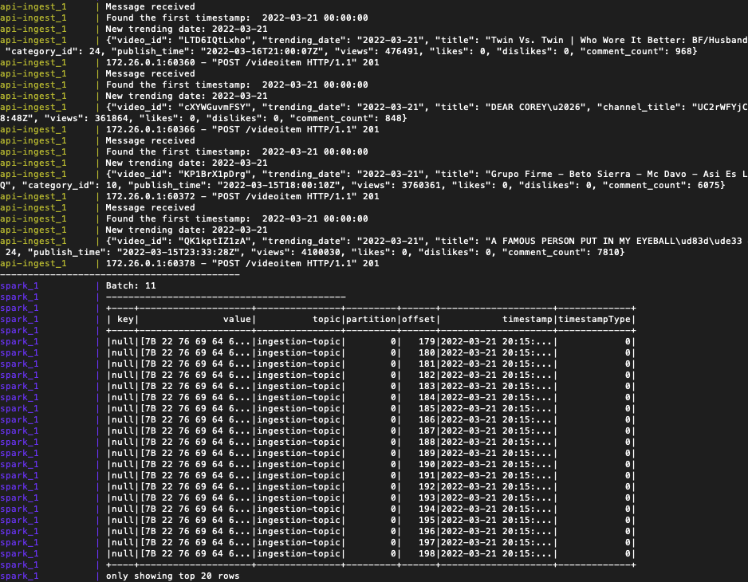
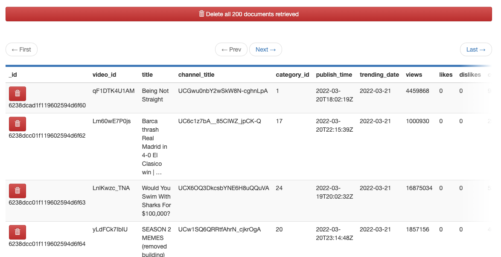

## Visualization with Streamlit
### Setup Streamlit
- Once the records are successfully loaded in the database, it's time to build a dashboard for end users
- Check out some <a href="https://streamlit.io/gallery" target="_blank">templates</a>, two simple tables are created as an example: video_id table and channel_title table, when users enter a video_id or channel_title, the relevant query result will appear in the table
- Run `pip install streamlit`, `pip install pymongo`
- Run [streamlitapp.py](./Streamlit/streamlitapp.py), copy the *[ARGUMENTS]* it provides and run it, then you will get the url if the browser didn't pop up automatically
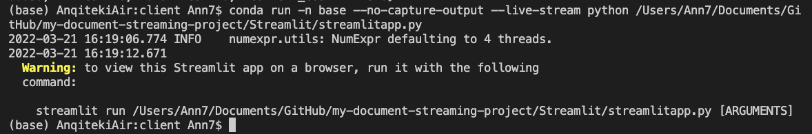
- Enter a *Video ID* and a *Channel Title* in the search boxes to test if tables are showing as expected

- Stop the container

### Add Streamlit to Docker
- Similar to how the image of API Ingest was created, use the [Dockerfile](./Streamlit/Dockerfile) and [requirement.txt](./Streamlit/requirements.txt) run `docker build -t streamlitapp .` to build the image
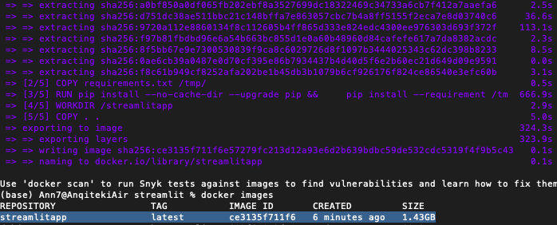
- In [docker-compose.yml](./docker-compose.yml) streamlitapp is added, this is the integrated compose file, you can use this container to try out this project from the beginning to the end

# Potential Future Steps
- Add an API between Streamlit and MongoDB, use username and password to improve the security
- Deploy the whole platform with all containers on a cloud platform

***

Inspired by this <a href="https://github.com/team-data-science/document-streaming" target="_blank">document streaming project</a>, if you have any comments or questions, feel free to reach out at anqiproject234@gmail.com 
